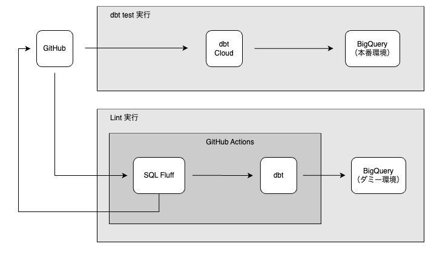

# sqlfluff-dbt-starterkit


これは [dbt](https://docs.getdbt.com/docs/introduction) での開発時（Pull Request 作成時）に SQL の Lint を行う GitHub Actions を構築するためのサンプルです。
SQL の Lint には [sqlfluff](https://docs.sqlfluff.com/en/stable/) を採用しています。

## 対応環境
- dbt Core / dbt Cloud
- GitHub Actions
- sqlfluff が対応している [DWH](https://docs.sqlfluff.com/en/stable/dialects.html)

### 対応ダミー環境
本システムはダミー環境を用意する必要があります。今後対応ダミー環境を増やしていく予定ですが、コントリビュートも歓迎です。
- [x] BigQuery
- [ ] Snowflake
- [ ] Amazon Redshift
- [ ] Azure Synapse Analytics

## システム構成図
システムの構築図は以下のようになります。

sqlfluff で dbt のテンプレートを使用するため、dbt を CI 環境にインストールします。
また、dbt で SQL のコンパイルを行うためには BigQuery に接続する必要があります。

SQL のコンパイルにはテーブルへのアクセスは行いませんが、CI 環境から本番環境の GCP プロジェクトに接続できない様にしました。
そのため、プロジェクト単位でダミー環境を作成してください。



### 利用している OSS
| OSS 名 | ライセンス |
| :-: | :-: |
| [dbt-bigquery](https://github.com/dbt-labs/dbt-bigquery) | Apache-2.0 |
| [dbt-duckdb](https://github.com/duckdb/dbt-duckdb) | Apache-2.0 |
| [sqlfluff](https://github.com/sqlfluff/sqlfluff) | MIT |

## CI 環境構築の大まかな流れ
以下の手順で CI 環境を構築します。
1. [ダミー環境の作成](#ダミー環境の作成)
2. [GitHub と Google Cloud の連携設定](#github-と-google-cloud-の連携設定)
3. [リントの設定](#リントの設定)

### ダミー環境の作成

#### BigQuery
CIの認証を通すためのダミー環境を作成します。
この環境は認証以外では使いません。

自由に作成してください。
ここでは公式ドキュメントの手順をご紹介します。

Google Cloud 公式ドキュメントの [ホーム > Apigee  > ドキュメント  > ガイド](https://cloud.google.com/apigee/docs/hybrid/v1.2/precog-gcpproject?hl=ja) の手順でプロジェクトの作成を行います。

#### Redshift
`sh .dbt/install_duckdb.sh`を実行して、DuckDBのインストールとファイル作成をしてください。
作成された`dummy.duckdb`というファイルをコミットしてください。

Bigquery の Cloud Console を利用できない場合は [ホーム > BigQuery > ドキュメント > ガイド](https://cloud.google.com/bigquery/docs/bigquery-web-ui?hl=ja) の手順で BigQuery API を有効にしてください。

### GitHub と Google Cloud の連携設定
[google-GitHub-actions/auth](https://github.com/google-github-actions/auth) を利用して行います。

#### Google Cloud 側の設定
発行したサービスアカウントキーを Google Cloud 外部で利用することは、鍵の漏洩リスクがあります。今回は、そのリスクを回避しつつ GCP の認証を行うことができる Workload Identity 連携を利用します。

[google-github-actions/auth](https://github.com/google-github-actions/auth) の README にある [Setting up Workload Identity Federation](https://github.com/google-github-actions/auth#setting-up-workload-identity-federation) の手順で設定を行います。

#### GitHub 側の設定
Actions secrets に WORKLOAD_IDENTITY_PROVIDER と SERVICE_ACCOUNT を登録することで動作するようにしたのでこれらを設定します。

GitHub Docs の [GitHub Actions > Security guides > Encrypted secrets](https://docs.github.com/en/actions/security-guides/encrypted-secrets) の手順で Actions secrets の登録をしてください。

WORKLOAD_IDENTITY_PROVIDER には `projects/123456789/locations/global/workloadIdentityPools/my-pool/providers/my-provider` のような値を設定します。

SERVICE_ACCOUNT には `my-service-account@my-project.iam.gserviceaccount.com` のような値を設定します。

### リントの設定
dbt プロジェクトを作成する dbt init コマンドを実行し、そこにリント設定を行ったものがこのレポジトリです。後ほど紹介するファイルを dbt プロジェクト内に配置することで動作させることができます。

#### dialect の設定
本番環境で利用している DWH に合わせて設定をします。
sqlfluff 公式ドキュメントの [Dialects Reference](https://docs.sqlfluff.com/en/stable/dialects.html?highlight=dialect) で対応環境の確認ができます。

Actions secrets で本番環境を DIALECT として登録をしてください。
BigQuery の場合は bigquery のように小文字で登録します。

#### dbt init をする代わりにレポジトリをコピーして利用する方法
```sh
$ git clone  git@github.com:kazaneya/sqlfluff-dbt-starterkit.git new_repo
```

#### dbt プロジェクト内にリント設定をコピーする方法
以下を dbt プロジェクトにコピーしてください。

```
.dbt/
.github/
.sqlfluff
.sqlfluffignore
```

#### Pull Request 作成時に動作させるように設定を変更する
[.github/workflows/actions.yml](.github/workflows/actions.yml#L3) の3行目をコメントアウトの指示に従って変更します。

変更前
```yml
on: [workflow_dispatch] # workflow_dispatch から pull_request に変更する
```

変更後
```yml
on: [pull_request]
```

#### リントの動かし方
.sql ファイルの変更がある Pull Request を作成すると自動的に動作します。
Linter のエラー内容は Pull requests 内の Files changed で確認することができます。

ルールの詳細は[ガイドライン](docs/guideline.md)を参照してください。

## GitHub Actions で利用しているパッケージのアップデートについて
GitHub Actions で利用しているパッケージのバージョンは [requirements.txt](requirements.txt) で指定しています。パッケージを最新バージョンに保つために [Dependabot](https://docs.github.com/ja/code-security/dependabot) を導入し、パッケージのアップデートがある場合に自動的に Pull Request が作成される仕様にしました。
Dependabot で作成された Pull Request で CI を動作させるために Actions secrets と同様の値を Dependabot secrets にも設定してください。

作成された Pull Request の CI の動作結果に応じて以下のような対応をしてください。
- CI が正常に動作した場合（または、エラーの解消ができた場合）
  - デフォルトブランチにマージする
- CI がエラーになった場合
  - マージはせずに原因を調査する（パッケージのバージョンによる依存関係でエラーになっている可能性が高いです）
